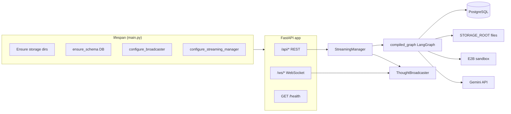
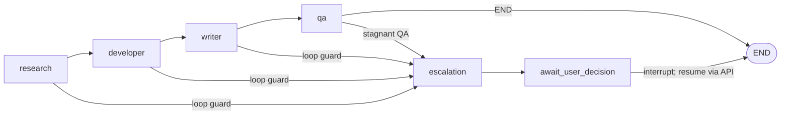
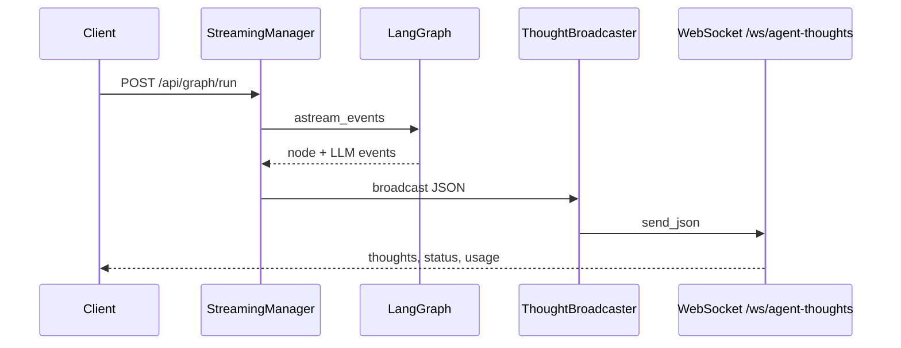

# Backend — AI Agentic Office API

FastAPI app ที่รวม **LangGraph** (`agents/graph.py`) กับสตรีมเหตุการณ์ผ่าน WebSocket และเก็บผลลัพธ์ลง PostgreSQL / ไฟล์

รายละเอียดการรันและตัวแปรสภาพแวดล้อมสรุปที่รากโปรเจกต์: [`../README.md`](../README.md)

## LangGraph ทำงานอย่างไร และมีประโยชน์ยังไงในระบบนี้

**LangGraph** เป็นเลเยอร์ orchestration บน LangChain ที่จัด workflow หลายขั้นเป็น **กราฟสถานะ (state machine)** แทนการเรียก LLM เป็นสคริปต์ยาวๆ หรือ chain เส้นตรงอย่างเดียว ในโปรเจกต์นี้กราฟถูกประกอบที่ [`agents/graph.py`](agents/graph.py) และรันผ่าน [`agents/streaming_manager.py`](agents/streaming_manager.py)

### ประโยชน์หลักที่ได้ใช้จริง

| ประเด็น | ในระบบนี้ |
|----------|------------|
| **สถานะร่วม (`OfficeState`)** | โหนด `research` → `developer` → `writer` → `qa` แชร์ state เดียวกัน (ข้อความ, งาน, artifacts, ตัวนับลูป) — ไม่ต้องส่งพารามิเตอร์หลายชั้นเองทุกครั้ง |
| **เส้นทางแบบมีเงื่อนไข** | `add_conditional_edges` + `should_continue` / `route_after_qa` แยกเส้นทางไป **escalation** เมื่อลูปมากเกินไปหรือ QA ติดลูปซ้ำ — กฎอยู่ในกราฟ ชัดเจนกว่า if/else กระจายในโค้ด |
| **Checkpoint + `thread_id`** | `MemorySaver` + `configurable.thread_id` เก็บ snapshot ระหว่างรัน — จำเป็นสำหรับ **หยุดและต่อ** หลัง human-in-the-loop |
| **Human-in-the-loop (`interrupt_before`)** | compile ด้วย `interrupt_before=["await_user_decision"]` — หลังโหนด `escalation` กราฟหยุดก่อน `await_user_decision` แล้วให้ client ส่ง `POST /api/graph/resume` พร้อม `thread_id` |
| **Resume ด้วย `Command`** | `resume_escalation` ส่ง `Command(update={"artifacts": ...})` เข้ากราฟเดิม — ต่อจาก checkpoint โดยไม่เริ่ม workflow ใหม่ทั้งก้อน |
| **สังเกตการณ์แบบสตรีม** | `astream_events(..., version="v2")` ดึงเหตุการณ์โหนด/LLM ออกมา → map เป็นบทบาท UI (`NODE_TO_AGENT`) → broadcast ทาง WebSocket — แดชบอร์ดเห็นความคิดและ usage ตามขั้นจริง |
| **ขีดจำกัดความลึกของกราฟ** | `graph_runtime_config()` ตั้ง `recursion_limit` (และมี path จัดการ `GraphRecursionError` ใน streaming manager) — กันวงจร/การเรียกซ้อนที่บานปลาย |

### สรุปสั้นๆ

LangGraph ทำให้ **workflow ออฟฟิศ** (หลายเอเจนต์ต่อเนื่องกัน) เป็นโครงสร้างที่อ่านและแก้ได้ รองรับ **การหยุดรอผู้ใช้** และ **การสตรีมเหตุการณ์** ได้ตรงกับที่ FastAPI/WebSocket ต้องการ — โดยไม่ต้องประดิษฐ์ state machine และ checkpoint เองทั้งระบบ

## Architecture

### Bootstrap และการเชื่อมต่อ

### ลำดับการรันกราฟ (สรุป)

- **Loop guard:** `loop_counter > 10` → ไป `escalation` (`agents/graph.py`).
- **QA stagnant:** ความคล้ายของ feedback สูงเกินเกณฑ์ → ไป `escalation`.
- **Interrupt:** กราฟ compile ด้วย `interrupt_before=["await_user_decision"]` — หลัง `escalation` จะหยุดก่อนโหนดถัดไป; ไคลเอนต์เรียก `POST /api/graph/resume` เพื่อดำเนินการต่อ

### สตรีมความคิดและสถานะ

โหนดกราฟแมปไปยังบทบาท UI ใน `streaming_manager.NODE_TO_AGENT` (เช่น `escalation` → `pm`).

## API และฟีเจอร์

| Method | Path | คำอธิบาย |
|--------|------|----------|
| `GET` | `/health` | สถานะบริการ `{ "status": "ok" }` |
| `POST` | `/api/graph/run` | เริ่มรันกราฟ; body: `topic`, optional `human_feedback` |
| `POST` | `/api/graph/resume` | ดำเนินการหลัง escalation; body: `thread_id`, `choice`, optional `new_instructions` |
| `GET` | `/api/outputs` | รายการ artifact จาก DB |
| `GET` | `/api/outputs/{artifact_id}/file` | ส่งไฟล์ผลลัพธ์; query `download` สำหรับ attachment |
| WebSocket | `/ws/agent-thoughts` | รับ JSON events (ความคิดเอเจนต์, สถานะ, token usage ฯลฯ); client ส่งข้อความเพื่อ keep-alive |

**Swagger:** `http://localhost:8000/docs` (เมื่อรัน `uvicorn`)

## โมดูลหลัก

| Path | บทบาท |
|------|--------|
| `agents/graph.py` | ประกอบ `StateGraph`, checkpointer, เส้นทางเงื่อนไข |
| `agents/nodes.py` | `research_node`, `writer_node`, `qa_node` |
| `agents/developer.py` | `developer_node` — ReAct + เครื่องมือ E2B |
| `agents/escalation.py` | `office_manager_escalation_node`, `await_user_decision_node` |
| `agents/streaming_manager.py` | รันกราฟ, สตรีม events, resume escalation |
| `agents/thoughts.py` | `emit_thought` → broadcaster |
| `api/routes.py` | REST ภายใต้ prefix `/api` |
| `api/websocket.py` | WebSocket `/ws/agent-thoughts` |
| `core/config.py` | `pydantic-settings` จาก `.env` |
| `db/` | SQLAlchemy async, models, schema init |
| `memory_service.py` | RAG / embedding / ingest (เมื่อ `RAG_ENABLED`) |
| `integrations/` | `e2b_sandbox.py`, `supplemental_research.py`, `vector_store.py` |
| `storage/output_store.py` | บันทึกไฟล์ Writer ลงดิสก์ |

## Environment variables

สรุปจาก [`backend/.env.example`](.env.example) (ไม่ใส่ค่าลับใน repo):

| Variable | หมายเหตุ |
|----------|-----------|
| `DATABASE_URL` | PostgreSQL async (เช่น `postgresql+asyncpg://...`) |
| `REDIS_URL` | Redis (ระบุใน `.env.example`; ใช้งานตามที่แอปอ้างอิง) |
| `CORS_ORIGINS` | คั่นด้วย comma เช่น `http://localhost:3000` |
| `VECTOR_DIMENSION` | ขนาดเวกเตอร์ embedding (ค่าเริ่ม 1536) |
| `RAG_ENABLED` | `true`/`false` — ควบคุม path หน่วยความจำ/RAG |
| `EMBEDDING_MODEL` | โมเดล embedding Gemini (ต้องสอดคล้อง `VECTOR_DIMENSION`) |
| `E2B_API_KEY` | แซนด์บ็อกซ์สำหรับ Developer |
| `GOOGLE_API_KEY` | Gemini — Researcher, Writer, QA, Developer, escalation |
| `GEMINI_MODEL` | รหัสโมเดลแชท (เช่น `gemini-2.5-pro`) |
| `STORAGE_ROOT` | โฟลเดอร์เก็บ output (สัมพัทธ์จาก `backend/` ถ้าไม่ใช่ absolute path) |
