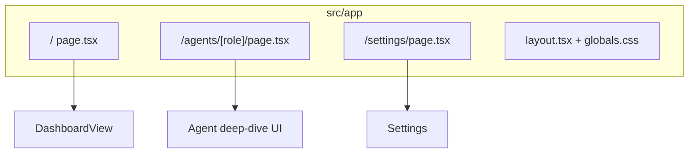
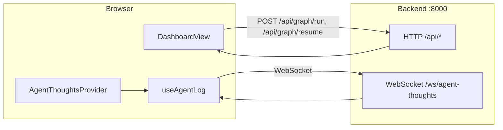

# Frontend — Agentic Office Dashboard

แอป **[Next.js 14](https://nextjs.org/)** (App Router) แดชบอร์ดสำหรับรัน office workflow, ดู log/ความคิดเอเจนต์แบบเรียลไทม์ และจัดการ escalation

การติดตั้งและ URL พื้นฐาน: [`../README.md`](../README.md)

## Architecture

### App Router และหน้าหลัก



### การไหลของข้อมูล



- **HTTP:** `getApiBaseUrl()` จาก `NEXT_PUBLIC_API_URL` (ค่าเริ่ม `http://localhost:8000`) — ใช้ใน `dashboard-view.tsx` สำหรับรันกราฟและ resume escalation
- **WebSocket:** `getWsBaseUrl()` + path `/ws/agent-thoughts` — สร้างใน `useAgentLog.ts` (`useAgentLogWebSocket`)

## โฟลเดอร์สำคัญ

| Path | เนื้อหา |
|------|---------|
| `src/app/` | Routes: หน้าแรก (แดชบอร์ด), `/agents/[role]`, `/settings`, layout |
| `src/components/` | UI หลัก: `dashboard-view`, `manager-intervention-panel`, `output-gallery`, `agent-deep-dive-*`, `app-shell`, ฯลฯ |
| `src/context/` | `agent-thoughts-context` — wrap แอปด้วย provider สำหรับ log/สถานะ |
| `src/hooks/` | `useAgentLog` — subscription WebSocket, สถานะเอเจนต์, escalation, token usage |
| `src/lib/` | `agents.ts` (บทบาท), `env.ts` (base URL), `office-ui.ts` ฯลฯ |

## การรัน

```bash
cd frontend
npm install
cp .env.example .env.local   # ทางเลือก
npm run dev
```

เปิด [http://localhost:3000](http://localhost:3000)

## Environment variables

จาก [`.env.example`](.env.example):

| Variable | คำอธิบาย |
|----------|-----------|
| `NEXT_PUBLIC_API_URL` | Base URL ของ FastAPI (ค่าเริ่ม `http://localhost:8000`) |
| `NEXT_PUBLIC_WS_URL` | Base ของ WebSocket (ค่าเริ่ม `ws://localhost:8000`; client ต่อ path `/ws/agent-thoughts`) |

## หมายเหตุ

- การสมัครรับความคิดเอเจนต์ใช้ **`useAgentLog` / `useAgentLogWebSocket`** ใน `useAgentLog.ts` — ไม่ใช้ไฟล์ `useAgentThoughtsWebSocket` แยก (ถ้าเคยอ้างอิงในเอกสารเก่าให้ใช้ hook ปัจจุบันแทน)
